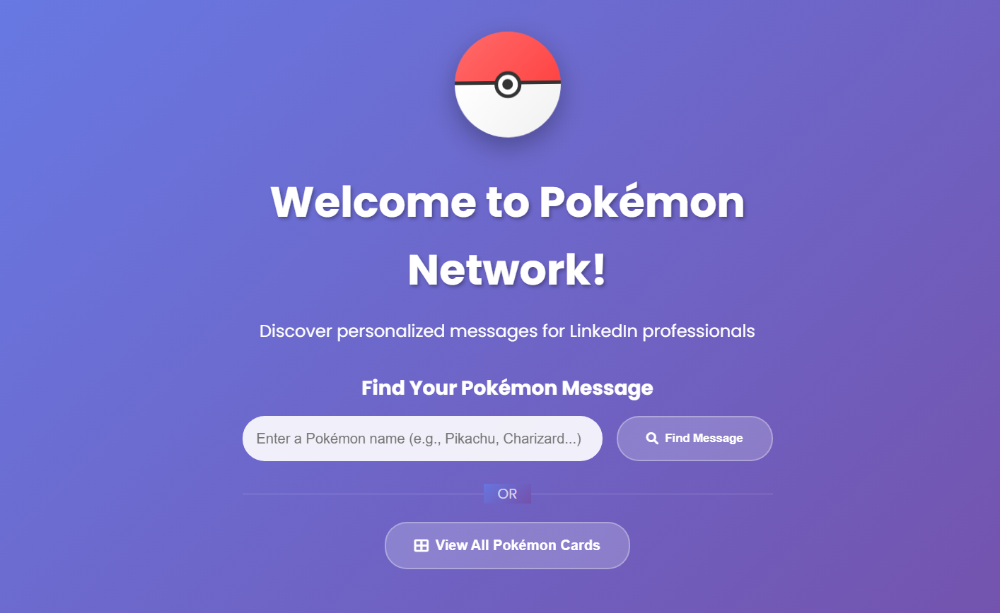

# 🐉 Pokémons Docker and LinkedIn

A modern, interactive web application showcasing Docker skills through a fun Pokémon card collection submitted by my LinkedIn Network.



## 🎯 Project Overview

This project demonstrates Docker containerization skills by building a Node.js web application that displays Pokémon cards with funny phrases, submitted by LinkedIn connections. 
The application features a clean, modern design with interactive modals and is fully dockerized for easy deployment.

## ✨ Features

### 🎮 Core Functionality

- **Interactive Pokémon Cards**: Display 20 unique Pokémon cards in a responsive 4-column grid
- **Modal Pop-ups**: Click any card to view detailed information with GIFs and funny phrases
- **LinkedIn Integration**: Each card shows the LinkedIn profile of the person who submitted it
- **Responsive Design**: Fully mobile-responsive layout with smooth animations

### 🎨 Design Features

- Modern gradient backgrounds and playful colors
- Smooth hover effects and transitions
- Font Awesome icons and Google Fonts (Poppins)
- Card animations with Intersection Observer API
- Error handling with custom 404 page

### 🐳 Docker Features

- Multi-stage Docker build for production optimization
- Docker Compose setup for easy deployment
- Health checks for container monitoring
- Non-root user security implementation
- Volume mounting for data persistence

## 🚀 Quick Start

### Prerequisites

- Docker and Docker Compose installed
- Node.js 18+ (for local development)

### Using Docker (Recommended)

1. **Clone the repository**

   ```bash
   git clone https://github.com/KseniiaRiabova/pokemons-docker-and-linkedin.git
   cd pokemons-docker-and-linkedin
   ```

2. **Run with Docker Compose**

   ```bash
   docker-compose up --build
   ```

3. **Access the application**
   Open your browser and navigate to `http://localhost:3000`

### Local Development

1. **Install dependencies**

   ```bash
   npm install
   ```

2. **Set up environment variables**

   ```bash
   cp .env.example .env
   ```

3. **Start the development server**
   ```bash
   npm run dev
   ```

## 📁 Project Structure

```
pokemons-docker-and-linkedin/
├── app.js                 # Main Express application
├── package.json           # Node.js dependencies and scripts
├── Dockerfile            # Docker image configuration
├── docker-compose.yml    # Multi-container Docker setup
├── healthcheck.js        # Container health check script
├── .env.example          # Environment variables template
├── data/
│   └── pokemons.json     # Pokémon dataset
├── routes/
│   └── index.js          # Application routes
├── views/
│   ├── layout.ejs        # Main layout template
│   ├── index.ejs         # Home page template
│   └── 404.ejs           # Error page template
├── public/
│   ├── css/
│   │   └── style.css     # Main stylesheet
│   └── js/
│       └── main.js       # Client-side JavaScript
└── README.md             # Project documentation
```

## 🔧 Technologies Used

### Backend

- **Node.js**: Runtime environment
- **Express.js**: Web framework
- **EJS**: Template engine for server-side rendering
- **Express-EJS-Layouts**: Layout management for EJS

### Frontend

- **HTML5 & CSS3**: Structure and styling
- **JavaScript (ES6+)**: Interactive functionality
- **Font Awesome**: Icons and social media badges
- **Google Fonts**: Typography (Poppins)

### DevOps & Deployment

- **Docker**: Containerization
- **Docker Compose**: Multi-container orchestration
- **MongoDB**: Optional database for future features

## 📊 Dataset Structure

The Pokémon data is stored in `data/pokemons.json` with the following structure:

```json
{
  "pokemonName": "Charizard",
  "phrase": "Charizard says: Always bring extra marshmallows to a flame battle!",
  "userName": "Jane Doe",
  "userProfile": "https://linkedin.com/in/janedoe",
  "image": "https://link-to-pokemon-image",
  "gif": "https://link-to-gif"
}
```

## 🐳 Docker Configuration

### Dockerfile Features

- **Multi-stage build**: Optimized for production
- **Security**: Non-root user implementation
- **Health checks**: Container monitoring
- **Alpine Linux**: Lightweight base image

### Docker Compose Services

- **web**: Node.js application container
- **mongo**: MongoDB database (optional, for future features)
- **Networking**: Custom bridge network for service communication

## 🎨 UI/UX Features

### Design Principles

- **Clean & Modern**: Gradient backgrounds with card-based layout
- **Interactive**: Hover effects and smooth transitions
- **Accessible**: Proper contrast ratios and keyboard navigation
- **Performance**: Lazy loading and optimized images

### Responsive Breakpoints

- **Desktop**: 1200px+ (4 cards per row)
- **Tablet**: 768px-1199px (2-3 cards per row)
- **Mobile**: <768px (1 card per row)

## 🔮 Future Enhancements

### Planned Features

- [ ] MongoDB integration for dynamic data storage
- [ ] POST API for adding new Pokémon cards
- [ ] Admin panel for card management
- [ ] Search and filter functionality
- [ ] User authentication system
- [ ] Real-time updates with WebSockets

### Technical Improvements

- [ ] TypeScript migration
- [ ] Unit and integration tests
- [ ] CI/CD pipeline with GitHub Actions
- [ ] Kubernetes deployment manifests
- [ ] Performance monitoring and analytics

## 🤝 Contributing

Contributions are welcome! 
Please feel free to submit a Pull Request. For major changes, please open an issue first to discuss what you would like to change.

### Development Setup

1. Fork the repository
2. Create your feature branch (`git checkout -b feature/AmazingFeature`)
3. Commit your changes (`git commit -m 'Add some AmazingFeature'`)
4. Push to the branch (`git push origin feature/AmazingFeature`)
5. Open a Pull Request

## 📝 License

This project is licensed under the MIT License - see the [LICENSE](LICENSE) file for details.

## 🙏 Acknowledgments

- **LinkedIn Network**: Thank you to everyone who contributed Pokémon ideas and phrases
- **PokéAPI**: For providing the amazing Pokémon images and sprites
- **Docker Community**: For the excellent documentation and best practices
- **Open Source Community**: For the tools and libraries that made this project possible

## 📬 Contact

**Kseniia Riabova**

- 🔗 LinkedIn: [linkedin.com/in/riabovakseniia](https://www.linkedin.com/in/riabovakseniia/)
- 🐙 GitHub: [github.com/KseniiaRiabova](https://github.com/KseniiaRiabova)
- 📧 Email: [kseniaistratova@gmail.com](kseniaistratova@gmail.com)

---

Made with ❤️ and Docker 🐳 by Kseniia Riabova
